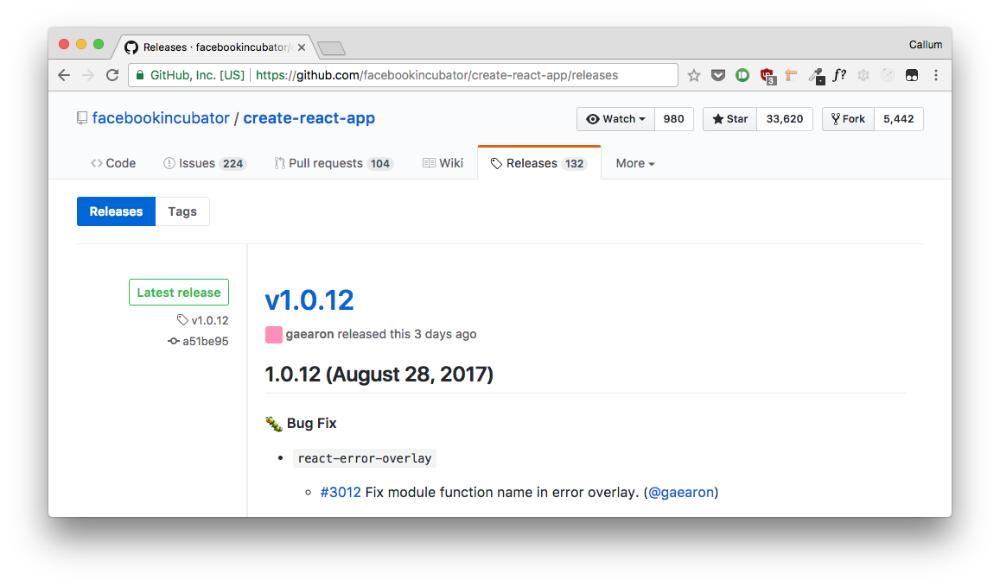

# Custom React App
_Any commands below will assume you're using `yarn`. If you're not, you can install it [here](https://yarnpkg.com/en/docs/install). If you're still not, good luck._

Facebook's `create-react-app` (which I will sporadically refer to as CRA) is a great way to bootstrap a new site, and comes with a number of other benefits: config is hidden away in one dependency, leaving you to get on with the important stuff and taking a cognitive load off; you can update a project with the latest of all this config and tooling, in-place, in just a few seconds; and every project built with it has a familiar base, reducing the ramp-up time as you and your teammates switch projects.

## The Problem
All of this is great, but sometimes you need that extra bit of configurability - one jest parameter which isn't supported by CRA, an extra webpack loader, or a different ESLint rule set. The easiest way to do this is to run `yarn eject`, unpacking all of what CRA hides away for you and dropping it in the project root for you to do with as you please. Unfortunately in doing this you lose the in-place updates with the latest tooling from Facebook, the configuration facade that lets you focus on development, and inevitably projects begin to diverge.

## The Solution
The `create-react-app` repository is an example of a [monorepo](https://medium.com/@bebraw/the-case-for-monorepos-907c1361708a) - it contains a number of packages, each its own module and individually published, but all having some involvement in `create-react-app`. One of these packages is called `react-scripts`, and within it is all of the configuration and default project files included when you create a new CRA project. By forking the repo and publishing our own version of the `react-scripts` package we can take full control of these, without losing the benefits of using `create-react-app`.

If you use the forked scripts on a team, this also means that one person's improvements can benefit everybody - even those working on existing projects - and you'll still get all the new work from Facebook's end too.

## How tho?

### Fork CRA
First, you need your own copy of CRA. To fork the repo, [open it on github](https://github.com/facebookincubator/create-react-app) and hit "Fork" in the top-right (sign in if you haven't already). This will create a copy of the repository under the same name but in your github account. Now clone your forked repo somewhere, `cd` in to it and run `yarn`. There'll be a little more output than usual here while it sets up dependencies for the individual packages within the repo.


### Make your changes

Once the process completes, browse to `packages/react-scripts` in your editor. You'll see a few key files and folders inside.

* `config` - contains configuration for Jest, webpack builds and dev server
* `scripts` - this scripts available for running in a `create-react-app` project such as `yarn start` and `yarn build`
* `template` - the files you actually see when you've run `create-react-app` - the base of every new project
  * note the file `gitignore` instead of `.gitignore` - this is to avoid ignoring files from the template itself, but will be automatically renamed when generating a project
* `package.json` - describes this package and its dependencies

This is where you can now customise the output of CRA to work better for you. Here are a few of our tweaks in the Amido fork, linked to the relevant commits in case you want to try something similar:
  
  * [CSS module support](https://github.com/facebookincubator/create-react-app/commit/49cff874da7127720260bae5a45ac57f56b34177) - because CSS modules are 🔥🔥🔥. We'd gotten used to the isolation and convenience of CSS modules and going back to plain CSS was not an option.
  * [Redux devtool store enhancer under `template\src\util`](https://github.com/facebookincubator/create-react-app/commit/9e62e10a7e2e5ca2541cce3444a8e51df9fd1fcf) - invaluable during development and preconfigured not to run in production, almost every project makes use of this. And if not, since it's in the `template` it's exposed and can be easily removed after project creation.
  * [Expose and modify `.eslintrc`](https://github.com/facebookincubator/create-react-app/commit/8f87c8a3f0f52a346a849f10c5fd18be8384f73f) - this still includes `react-app`'s default rules, but adds Airbnb's rules on top for cleaner and more consistent code. As we figure out an optimal rule set (some of Airbnb's are a little overzealous for our taste) we drop changes in here, and will eventually bring it back to the hidden `config` folder when we're happy with the set.
  * [Include .editorconfig](https://github.com/amido/create-react-app/commit/5091891866823f923264d8e11d2f14179fcf584b#diff-a5ccaae40c0850dda3e020a790e16c6d) - allowing supporting editors to automatically set indentation and other rules.

### Try it out

Once you're happy with your changes it's time to test them out. You'll need to head up to the root of your repo and create a project using your local changes:

```sh
cd ../.. # head up two levels from `react-scripts` to the CRA root
yarn create-react-app test-app
```

This command builds a local copy of `create-react-app`, integrating your changes, then uses it to create a `test-app` project.

If all goes well, you can now explore the resulting `test-app` folder and try running the project locally:

```sh
cd test-app
yarn start
```

### Publish

When you're happy with your changes, you just need to publish them to npm. This makes them publicly available and ready for consumption by anybody using `create-react-app`. If you don't have an npm account, first register and sign in by following the ["Create a user" instructions](https://docs.npmjs.com/getting-started/publishing-npm-packages).

Navigate back to the `packages/react-scripts` directory.

First, we need to give the package a distinct name. Open up `package.json` and replace the `name` field with whatever you want to call this package (this is what people will reference to use with CRA). Make sure it's available by checking `npm.im/<PACKAGE-NAME>`. For any future updates, note you'll also need to increment the version number.

Now, still in the `react-scripts` directory, run 
```bash
npm publish
``` 


### Huzzah!

Your customised `react-scripts` is now ready to be used by you and your team, or anyone you wish to share it with! Try it out like so, replacing 'amido-react-scripts' with your package's name:

```sh
yarn global add create-react-app # if you haven't installed CRA globally already
create-react-app --scripts-version=amido-react-scripts my-new-app
cd my-new-app
yarn start
```

If (as is hopefully the case) you find yourself using your custom scripts regularly, an alias can save time and make it easier to remember. In my `aliases.zsh` I have 

```zsh
alias create-amido-app="create-react-app --scripts-version=amido-react-scripts"
```

### Keeping up to date

The final thing you'll need to do is occasionally (or when particular features you want are added) pull in the latest upstream changes from `react-scripts`. The first step is to add the Facebook repo as a new remote.

```sh
git remote add upstream https://github.com/facebookincubator/create-react-app.git
git fetch --all
```

Now - and this is important - _don't_ just pull in the latest from `upstream/master`. Master doesn't necessarily match up with the latest published release of all packages, and the `--scripts-version` flag only overrides the `react-scripts` package. If the latest code relies on unpublished versions of other packages in the repo, you'll run in to problems after merging.

To merge published changes only, head over to the [CRA Releases page](https://github.com/facebookincubator/create-react-app/releases) and grab the commit hash from the latest release. At the time of writing, for example, that's `a51be95`.



Now you can safely merge in the changes up to that release and publish your latest version.

```sh
git merge a51be95
# Fix any conflicts that might arise
npm publish
```

That's it!

## some kinda outro

hello bye bye